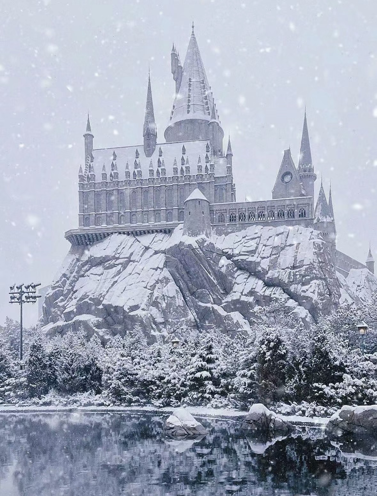

# qxie2876_9103_tut7_GroupA

# Claude Monet 'Saint Georges majeur au crépuscule'

## Instructions

1. Open the `index.html` file in a web browser.
2. The animation will start automatically.
3. Snowflakes will fall continuously, creating a winter atmosphere.

## Details

### Individual Approach

My individual approach to animating the group code focuses on adding a snowfall effect driven by Perlin noise. The snowflakes are generated randomly and add a serene and immersive element to the animated landmark. Perlin noise is used to calculate the horizontal movement of the snowflakes, creating a more natural and organic motion.

### Animated Properties

The snowfall effect is the main animated property in my individual code. The snowflakes are generated randomly and fall from the top of the canvas. Each snowflake has a unique size and falls at a different speed, creating a diverse and dynamic snowfall effect.

### Inspiration

The snowfall effect was inspired by winter scenes in Hogwarts at Universal Studios and the serene atmosphere they create.

## Technical Explanation

The snowfall effect is achieved using the `Snowflake` class. Each snowflake is an instance of the `Snowflake` class, with properties such as position, velocity, acceleration, and radius. The `update()` method of the `Snowflake` class updates the snowflake's position based on the applied forces and velocity.

Perlin noise is used to calculate the horizontal offset of the snowflakes, creating a natural and organic motion. The `noise()` function is used to generate Perlin noise values based on the snowflake's position and time.

A gravity force is applied to the snowflakes to simulate their falling motion. The velocity and acceleration of each snowflake are updated accordingly.

The `display()` method of the `Snowflake` class displays the snowflake on the canvas as a white ellipse with a size based on its radius.

### Changes to Group Code

No significant changes were made to the group code. The snowfall effect was added as an additional layer on top of the existing animation.

### External Tools and Techniques

The Snowflake class is inspired by The Coding Train on Youtube ([Coding Train: Snowfall Simulation](https://www.youtube.com/watch?v=cl-mHFCGzYk))

## References
- [p5.js Reference](https://p5js.org/reference/#/p5/noise)
- [Coding Train: Snowfall Simulation](https://www.youtube.com/watch?v=cl-mHFCGzYk)

